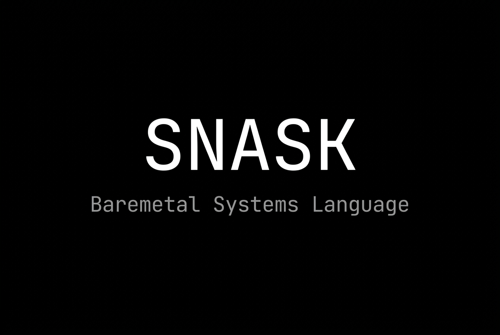
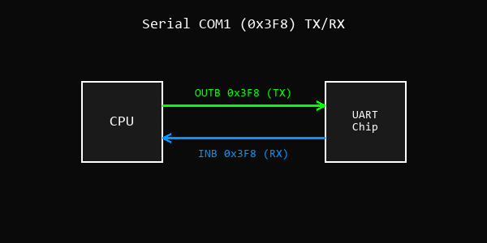
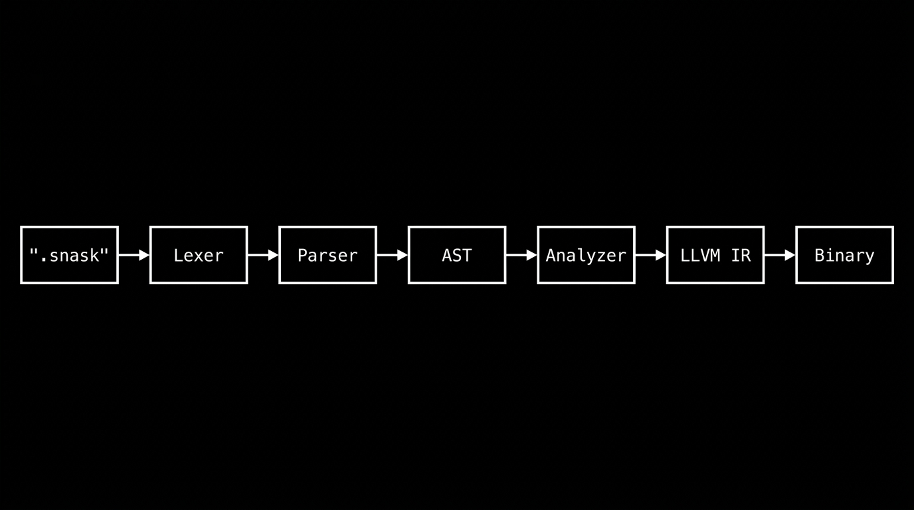
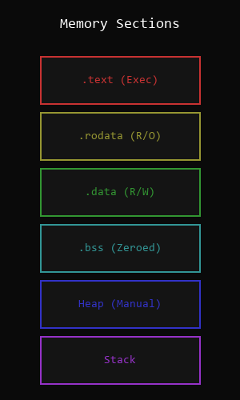
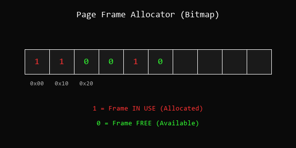
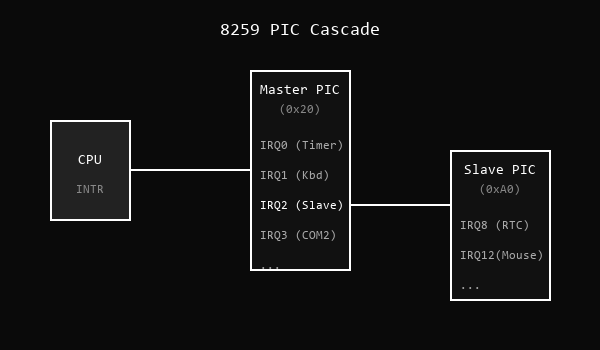

<p align="center">
  
</p>

<h1 align="center">Snask v0.5.0-baremetal</h1>

<p align="center">
  
  
  
  
  
</p>



---

## O que é Snask

Snask é uma linguagem de programação compilada AOT via **LLVM 18**, projetada exclusivamente para desenvolvimento baremetal: sistemas operacionais, kernels, drivers de hardware, emuladores e firmware. Não há classes, garbage collector, strings gerenciadas, listas ou dicionários. Cada instrução no código-fonte mapeia diretamente para instruções de máquina sem overhead invisível.

Uma string literal como `"hello"` compila para um ponteiro cru (`Ptr`) apontando para bytes terminados em nulo na seção `.rodata`. Números compilam para inteiros de máquina. Funções geram código nativo sem prólogos invisíveis. O que você escreve é o que a CPU executa.

O compilador é escrito em Rust e gera LLVM IR, aproveitando as otimizações do backend LLVM 18 para produzir binários eficientes para x86, x86_64, ARM e RISC-V.

---

## Filosofia

**"O hardware dita as regras."**

- **Zero overhead oculto:** nenhuma alocação implícita, nenhuma inicialização invisível.
- **Controle explícito:** operações perigosas exigem `@unsafe` e intrínsecos nomeados.
- **Interop C simples:** structs com `repr_c` e ponteiros brutos para falar com código externo.

**Snask vs C:** Snask moderniza a sintaxe do C, substituindo macros obscuras por intrínsecos claros (`@inb`, `@outb`, `@volatile`). A separação entre código seguro e unsafe é explícita na gramática.

**Snask vs Rust:** Snask não impõe borrow checker. Em baremetal, aliasing de ponteiros MMIO é intencional e frequente. Snask exige responsabilidade do programador ao invés de restringi-lo.

**Snask vs Zig:** Zig oferece metaprogramação complexa com `comptime`. Snask prefere manter a linguagem enxuta e previsível, sem camadas extras de abstração.

---

## Instalação

### Compilação Manual (Recomendado)

Requisitos: **Rust 1.85+** e **LLVM 18**.

```bash
git clone https://github.com/rancidavi-dotcom/TheSnask.git
cd TheSnask

# Instalar LLVM 18 (Debian/Ubuntu)
sudo apt-get install llvm-18 llvm-18-dev

# Compilar
cargo build --release

# Adicionar ao PATH
export PATH=$PATH:$(pwd)/target/release
```

Se o Cargo reclamar do `llvm-config`, exporte: `LLVM_SYS_180_PREFIX=/usr/lib/llvm-18`.

### Via AUR (Arch Linux)

```bash
yay -S snask-git
```

### Via .deb (Debian/Ubuntu)

```bash
wget https://github.com/rancidavi-dotcom/TheSnask/releases/download/v0.5.0/snask_0.5.0_amd64.deb
sudo dpkg -i snask_0.5.0_amd64.deb
```

---

## Sintaxe Básica

Snask usa **indentação** para blocos (sem `{ }`). Funções usam `fun`, retorno com `:` (não `->`). Variáveis são declaradas com `let` (imutável), `mut` (mutável) ou `const` (compile-time).

```snask
fun add(a: I32, b: I32) : I32
    return a + b

fun main() : I32
    let x: I32 = add(40, 2)
    return x
```

Compilar e executar:

```bash
snask build main.snask --output main
./main
```

---

## Exemplos

### 1. Constantes e Variáveis

```snask
const VGA_ADDR: U64 = 0xB8000
const VGA_WIDTH: I32 = 80
const VGA_HEIGHT: I32 = 25

mut counter: U64 = 0
let message: Ptr = "Snask Kernel"
```

### 2. Structs e Layout de Memória

```snask
struct GdtEntry
    limit_low: U16
    base_low: U16
    base_middle: U8
    access: U8
    granularity: U8
    base_high: U8

struct Point
    volatile x: I32
    volatile y: I32
```

Campos com `volatile` garantem que leituras/escritas não sejam otimizadas pelo LLVM.

### 3. Funções e Modificadores

```snask
// Função normal
fun soma(a: I32, b: I32) : I32
    return a + b

// Função unsafe — pode acessar hardware
@unsafe fun write_vga(addr: U64, val: I32)
    @store(addr, val)

// Função interrupt — gera iret no epilogo (para ISRs)
@naked fun isr_handler()
    @asm("iretq")

// Função extern — símbolo resolvido no linker
@extern fun putchar(c: I32) : I32
```

### 4. Escrevendo no VGA Buffer (Kernel Baremetal)

```snask
@global_asm(".section .text")
@global_asm(".global _start")
@global_asm("_start: call kmain")
@global_asm("hlt_loop: hlt")
@global_asm("jmp hlt_loop")

const VGA: U64 = 0xB8000

@unsafe fun kmain() : I32
    // Escreve 'O' branco na primeira posição VGA
    @store(VGA, 0x0F4F)
    // Escreve 'K' na segunda posição
    @store(VGA + 2, 0x0F4B)
    return 0
```

### 5. Port I/O — Leitura do Teclado PS/2

```snask
const PS2_DATA: U16 = 0x60
const PIC_CMD: U16 = 0x20
const PIC_EOI: U8 = 0x20

@unsafe fun read_keyboard() : U8
    let scancode: U8 = @inb(PS2_DATA)
    return scancode

@unsafe fun ack_pic()
    @outb(PIC_CMD, PIC_EOI)
```

### 6. Timer PIT (Programmable Interval Timer)

```snask
const PIT_CMD: U16 = 0x43
const PIT_DATA: U16 = 0x40

@unsafe fun init_pit(hz: U32)
    let divisor: U32 = 1193180 / hz
    @outb(PIT_CMD, 0x36)
    @outb(PIT_DATA, divisor & 0xFF)
    @outb(PIT_DATA, (divisor >> 8) & 0xFF)

mut global_ticks: U64 = 0

@naked fun timer_isr()
    @asm("iretq")
```

### 7. Intrínsecos de Tipo e Memória

```snask
struct Packet
    src: U32
    dst: U32
    len: U16

fun struct_info() : U64
    let sz: U64 = sizeof(Packet)
    let al: U64 = alignof(Packet)
    let off: U64 = offsetof(Packet, len)
    return sz + al + off
```

### 8. Ponteiros, IntToPtr e PtrToInt

```snask
@unsafe fun ptr_demo() : U64
    let p: U64 = @inttoptr(0xB8000, U64)
    let addr: U64 = @ptrtoint(p, U64)
    return addr

@unsafe fun deref_demo(ptr: U64) : I32
    let val: I32 = @deref(ptr, I32)
    return val

@unsafe fun addr_demo() : U64
    mut x: I32 = 42
    let a: U64 = @addr(x)
    return a
```

### 9. Operações Atômicas e Barreiras de Memória

```snask
@unsafe fun spinlock_acquire(lock: U64)
    fence seq_cst
    atomic rmw(xchg, lock, 1, seq_cst)

@unsafe fun spinlock_release(lock: U64)
    atomic rmw(xchg, lock, 0, seq_cst)
    fence acqrel
```

### 10. Blocos Unsafe e Assembly Inline

```snask
@unsafe fun disable_interrupts()
    @asm("cli")

@unsafe fun enable_interrupts()
    @asm("sti")

@unsafe fun halt()
    @asm("hlt")

fun idle_loop()
    while true
        @unsafe
            @asm("hlt")
```

### 11. Serial UART COM1 Inicialização



```snask
const COM1: U16 = 0x3F8

@unsafe fun init_serial() : Bool
    @outb(COM1 + 1, 0x00)
    @outb(COM1 + 3, 0x80)
    @outb(COM1 + 0, 0x03)
    @outb(COM1 + 1, 0x00)
    @outb(COM1 + 3, 0x03)
    @outb(COM1 + 2, 0xC7)
    @outb(COM1 + 4, 0x0B)
    @outb(COM1 + 4, 0x1E)
    @outb(COM1 + 0, 0xAE)
    if @inb(COM1) != 0xAE
        return false
    @outb(COM1 + 4, 0x0F)
    return true

@unsafe fun serial_write(byte: U8)
    @outb(COM1, byte)
```

### 12. CMOS RTC — Leitura de Hora

```snask
const CMOS_ADDR: U16 = 0x70
const CMOS_DATA: U16 = 0x71

@unsafe fun rtc_read(reg: U8) : U8
    @outb(CMOS_ADDR, reg)
    return @inb(CMOS_DATA)

@unsafe fun get_seconds() : U8
    return rtc_read(0x00)

@unsafe fun get_minutes() : U8
    return rtc_read(0x02)

@unsafe fun get_hours() : U8
    return rtc_read(0x04)
```

---

## Pipeline de Compilação



O compilador Snask transforma código-fonte em binários nativos através de 6 estágios:

| Estágio | Módulo | Função |
|---------|--------|--------|
| 1. Lexer | `parser.rs` | Converte texto em tokens (keywords, literais, operadores) |
| 2. Parser | `parser.rs` | Constrói a AST (Abstract Syntax Tree) a partir dos tokens |
| 3. Análise Semântica | `semantic_analyzer.rs` | Verifica tipos, mutabilidade, escopo e valida a AST |
| 4. Geração LLVM IR | `llvm_generator.rs` | Traduz a AST em LLVM IR usando `inkwell` |
| 5. Otimização | LLVM 18 | Aplica passes de otimização (DCE, inlining, constant folding) |
| 6. Code Generation | LLVM 18 | Emite código de máquina nativo (ELF, objeto, flat binary) |

---

## Sistema de Tipos

Todos os tipos mapeiam diretamente para tipos de máquina. Não há boxing, coerção implícita ou tipos dinâmicos.

| Tipo | Tamanho | Descrição |
|------|---------|-----------|
| `Bool` | 8 bits | Verdadeiro/falso |
| `Void` | 0 bits | Sem retorno |
| `I8` | 8 bits | Inteiro com sinal (-128 a 127) |
| `I16` | 16 bits | Inteiro com sinal |
| `I32` | 32 bits | Inteiro com sinal (padrão) |
| `I64` | 64 bits | Inteiro com sinal longo |
| `U8` | 8 bits | Byte sem sinal (0 a 255) |
| `U16` | 16 bits | Sem sinal (portas I/O, VGA) |
| `U32` | 32 bits | Sem sinal (registradores hardware) |
| `U64` | 64 bits | Sem sinal (endereços, paginação) |
| `Usize` | arch | Tamanho de ponteiro (32 ou 64 bits) |
| `Isize` | arch | Offset com sinal |
| `Ptr` | arch | Ponteiro bruto (equivale a `void*` em C) |
| `F32` | 32 bits | Ponto flutuante IEEE 754 |
| `F64` | 64 bits | Ponto flutuante dupla precisão |

Tipos compostos: `struct Nome`, arrays `[T; N]`, `volatile T`, ponteiros de função `fun(T) : T`.

---

## Intrínsecos

Intrínsecos são prefixados com `@` e compilam diretamente para instruções de máquina ou nós LLVM IR.

| Intrínseco | Descrição | Exemplo |
|------------|-----------|---------|
| `@asm("...")` | Assembly inline | `@asm("cli")` |
| `@global_asm("...")` | Assembly global (bootloaders) | `@global_asm(".global _start")` |
| `@unsafe` | Bloco ou modificador unsafe | `@unsafe fun f()` |
| `@store(ptr, val)` | Escrita volátil na memória | `@store(0xB8000, 0x0F41)` |
| `@write(ptr, val, type)` | Escrita tipada na memória | `@write(addr, val, U16)` |
| `@deref(ptr, type)` | Leitura tipada da memória | `@deref(addr, I32)` |
| `@volatile(ptr, type)` | Leitura volátil (MMIO) | `@volatile(mmio_reg, U32)` |
| `@inb(port)` | Leitura de porta I/O x86 | `@inb(0x60)` |
| `@outb(port, val)` | Escrita em porta I/O x86 | `@outb(0x20, 0x20)` |
| `@inttoptr(val, type)` | Inteiro → ponteiro | `@inttoptr(0xB8000, U64)` |
| `@ptrtoint(ptr, type)` | Ponteiro → inteiro | `@ptrtoint(p, U64)` |
| `@addr(var)` | Endereço de variável | `@addr(minha_var)` |
| `sizeof(type)` | Tamanho em bytes | `sizeof(Point)` |
| `alignof(type)` | Alinhamento em bytes | `alignof(Point)` |
| `offsetof(struct, field)` | Offset de campo | `offsetof(Point, y)` |
| `fence ordering` | Barreira de memória | `fence seq_cst` |
| `atomic rmw(op, ptr, val, ord)` | Read-modify-write atômico | `atomic rmw(add, p, 1, seq_cst)` |

---

## Modelo de Memória



Snask não possui garbage collector nem alocador automático. A memória é organizada nas seções padrão ELF:

| Seção | Conteúdo |
|-------|----------|
| `.text` | Código das funções |
| `.rodata` | Strings literais e constantes (somente leitura) |
| `.data` | Variáveis globais mutáveis inicializadas |
| `.bss` | Variáveis globais não-inicializadas (zeradas no boot) |
| Stack | Variáveis locais e frames de chamada |
| Heap | Não existe nativamente — requer alocador manual |

Toda alocação dinâmica é responsabilidade do programador. Strings literais são ponteiros `Ptr` para dados na `.rodata`.

---

## Operadores

### Aritméticos
`+`, `-`, `*`, `/` (divisão real), `//` (divisão inteira), `%` (módulo)

### Comparação
`==`, `===` (estrita), `!=`, `>`, `<`, `>=`, `<=`

### Lógicos
`and`, `or`, `not`

### Bitwise
`&` (AND), `|` (OR), `^` (XOR), `<<` (shift left), `>>` (shift right), `~` (NOT bit-a-bit)

### Precedência (maior para menor)
1. Acesso: `[]`, `()`, `.`
2. Unários: `not`, `~`, `-`
3. Multiplicativos: `*`, `/`, `//`, `%`
4. Aditivos: `+`, `-`
5. Shifts: `<<`, `>>`
6. Bitwise: `&`, `^`, `|`
7. Comparação: `<`, `>`, `<=`, `>=`, `==`, `!=`, `===`
8. Lógicos: `and`, `or`

---

## Controle de Fluxo

```snask
// if / elif / else
if temp < 50
    set_fan(0)
elif temp < 80
    set_fan(1500)
else
    set_fan(5000)

// while
mut i: I32 = 0
while i < 100
    process(i)
    i = i + 1

// for ... in
for b in bytes
    @outb(0x3F8, b)
```

---

## Tabela de Features



| Feature | Status |
|---------|--------|
| `let`, `mut`, `const`, `if`, `while`, `for in` | ✅ Estável |
| Funções tipadas (`fun`, `return`) | ✅ Estável |
| Structs e `repr_c` | ✅ Estável |
| `@unsafe` gate | ✅ Estável |
| Assembly inline (`@asm`, `@global_asm`) | ✅ Estável |
| Port I/O (`@inb`, `@outb`) | ✅ Estável |
| Ponteiros (`@inttoptr`, `@ptrtoint`, `@addr`) | ✅ Estável |
| Memória (`@store`, `@write`, `@deref`, `@volatile`) | ✅ Estável |
| Introspection (`sizeof`, `alignof`, `offsetof`) | ✅ Estável |
| Atômicos (`fence`, `atomic rmw`) | ✅ Estável |
| Operadores bitwise (`&`, `\|`, `^`, `<<`, `>>`, `~`) | ✅ Estável |
| Operadores compostos (`+=`, `-=`, `*=`, `/=`) | ✅ Estável |
| LSP (Language Server Protocol) | 🔶 Parcial |
| `for in` sobre arrays | 🔶 Beta |

---

## Estrutura do Projeto

```
├── src/
│   ├── main.rs               # CLI principal (snask build, run, etc.)
│   ├── parser.rs              # Lexer + Parser → AST
│   ├── ast.rs                 # Definições da AST
│   ├── types.rs               # Sistema de tipos
│   ├── semantic_analyzer.rs   # Verificação semântica e de tipos
│   ├── llvm_generator.rs      # Geração de LLVM IR via inkwell
│   ├── compiler.rs            # Orquestrador de compilação
│   └── bin/snask-lsp.rs       # Servidor LSP
├── docs/
│   └── reference/BAREMETAL.md # Referência completa da linguagem
├── examples/                  # Programas de exemplo
└── Testes/                    # Testes de integração
```

---

## Tutorial: Mini Kernel x86



Passo a passo para compilar um kernel mínimo que escreve "OK" no VGA:

```snask
// kernel.snask
@global_asm(".section .text")
@global_asm(".global _start")
@global_asm("_start: call kmain")
@global_asm("_hlt: hlt")
@global_asm("jmp _hlt")

const VGA: U64 = 0xB8000

@unsafe fun kmain() : I32
    @store(VGA, 0x0F4F)       // 'O' branco em fundo preto
    @store(VGA + 2, 0x0F4B)   // 'K'
    return 0
```

Compilar:

```bash
snask build kernel.snask --profile baremetal --output kernel
```

Para criar um binário bootável, use um linker script e GRUB/Limine:

```bash
ld -T linker.ld -o kernel.elf kernel.o
```

---

## Compilação e Targets

```bash
# Build padrão (Linux nativo)
snask build main.snask --output main

# Build baremetal (sem runtime, freestanding)
snask build kernel.snask --profile baremetal --output kernel

# Gerar LLVM IR para inspeção
snask build main.snask --emit-llvm

# Build com otimização agressiva
snask build main.snask --release --lto
```

Profiles disponíveis:

| Profile | Descrição |
|---------|-----------|
| `baremetal` | Sem runtime, sem libc, freestanding |
| `systems` | Runtime mínimo, link com libc |

---

## LSP e Editor

O Snask inclui um servidor LSP básico em `src/bin/snask-lsp.rs` que provê:

- Syntax highlighting via semantic tokens
- Diagnósticos de erro em tempo real
- Símbolos do documento (funções, variáveis, structs)

Extensão para VS Code disponível em `vscode_extension/`.

---

## Contribuição

Snask está em alpha. Issues, PRs e discussões são bem-vindos.

- Bugs: [GitHub Issues](https://github.com/rancidavi-dotcom/TheSnask/issues)
- Discussões: abra uma issue com tag `discussion`
- Documentação: PRs em `docs/`

---

<p align="center">
  
  <br/>
  <strong>Snask</strong> — MIT License
</p>
