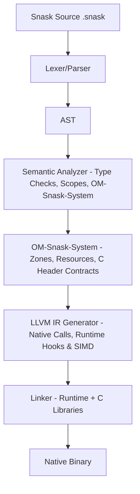

# 🏗️ Compiler & Runtime Architecture (v0.4.0)
### The Internal Design of the Snask Platform

This document explains the internal mechanisms of Snask v0.4.0.

---

## 1. Overview: The Compilation Pipeline

Snask uses an ahead-of-time (AOT) compilation strategy targeting LLVM IR.

Status note:
- This document describes the current pipeline plus the intended direction of the OM-Snask-System.
- Older docs that split memory OM and automatic C contracts were consolidated into `docs/OM_SNASK_SYSTEM.md`.
- For feature-by-feature reality, see `docs/FEATURE_STATUS.md`.



## 2. OM-Snask-System

The OM-Snask-System is the single memory/resource system of Snask. It includes the original memory model (`stack`, `heap`, `arena`, `zone`, `scope`, `promote`, `entangle`) and the C interop layer that scans headers, deduces contracts, applies optional `.om.snif` patches, and emits native LLVM calls to external C symbols.

This does not make Snask a transpiler: the output remains LLVM/native binary, and C libraries are used through ABI-level calls.

The user-facing goal is:

```snask
import_c_om "SDL2/SDL.h" as sdl2

zone "app":
    let window = sdl2.create_window("App", 0, 0, 800, 600, sdl2.WINDOW_HIDDEN)
```

The compiler/runtime goal is:

- manage Snask-owned memory through zones, arenas, stack, heap and promotion;
- infer safe constants, functions and opaque resources from the header;
- hide manual destructors behind OM zone cleanup;
- use `.om.snif` only as a small patch for exceptional APIs;
- block C functions whose pointer ownership cannot be proven safe.

For the full unified design, current status, examples and roadmap, see `docs/OM_SNASK_SYSTEM.md`.

---
🚀 **Auditable code, predictable performance. That's the Snask promise.**
