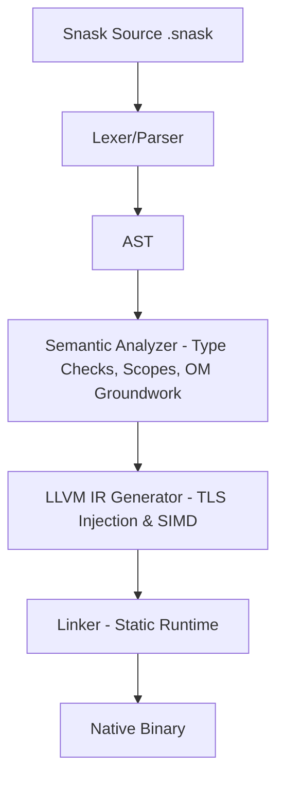

# 🏗️ Compiler & Runtime Architecture (v0.4.0)
### The Internal Design of the Snask Platform

This document explains the internal mechanisms of Snask v0.4.0.

---

## 1. Overview: The Compilation Pipeline

Snask uses an ahead-of-time (AOT) compilation strategy targeting LLVM IR.

Status note:
- This document describes the current pipeline plus the intended direction of OM.
- Some OM claims that appeared in older docs are still in progress and must not be read as fully implemented guarantees.
- For feature-by-feature reality, see `docs/FEATURE_STATUS.md`.

## 2. Orchestrated Memory (OM) v0.4.0
- **Current Reality**: Snask already exposes OM-oriented syntax and runtime strategies such as `stack`, `heap`, `arena`, `zone`, `scope`, `promote`, and `entangle`.
- **Semantic State**: The compiler currently performs scope and type checks, but a full borrow checker and formal `zone_depth` escape analysis are still planned work.
- **Runtime Direction**: The runtime already contains thread-local and specialized allocation pieces, but the language-level OM contract is not yet fully formalized.
- **Near-Term Goal**: Turn OM from a promising implementation direction into a specified, testable, compile-time-enforced model.

---
🚀 **Auditable code, predictable performance. That's the Snask promise.**
