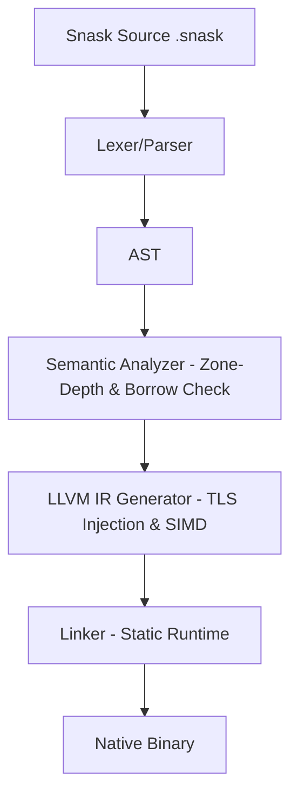

# 🏗️ Compiler & Runtime Architecture (v0.4.0)
### The Internal Design of the Snask Platform

This document explains the internal mechanisms of Snask v0.4.0.

---

## 1. Overview: The Compilation Pipeline

Snask uses an ahead-of-time (AOT) compilation strategy targeting LLVM IR.

## 2. Orchestrated Memory (OM) v0.4.0
- **Static Escape Analysis**: The Semantic Analyzer assigns `zone_depth` to every symbol. Violations trigger `SNASK-0402-ESCAPE`.
- **Shadow Arenas (TLS)**: `__thread` storage in `rt_obj.c` eliminates lock contention.
- **SIMD Alignment**: All Arena allocations are aligned to 64-byte boundaries for AVX-512 optimization.
- **Auto-Promotion**: The LLVM IR generator automatically injects `s_promote` calls for function returns that escape ephemeral zones.

---
🚀 **Auditable code, predictable performance. That's the Snask promise.**
