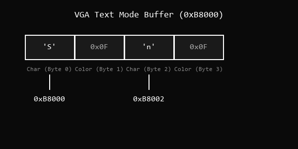
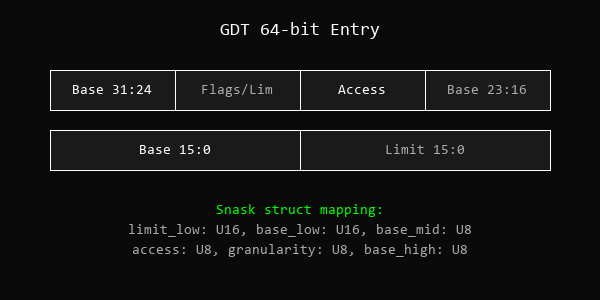

# Referência Completa da Linguagem Snask

## Parte 1: Fundamentos

### 1. Introdução

Snask é uma linguagem de programação compilada AOT via LLVM 18 para desenvolvimento baremetal. Não possui classes, garbage collector, strings gerenciadas ou abstrações de runtime. Cada construto da linguagem mapeia diretamente para instruções de máquina.

O público-alvo são desenvolvedores de sistemas operacionais, drivers de hardware, firmware e emuladores que precisam de controle total sobre memória, registradores e I/O.

O compilador é escrito em Rust e usa a biblioteca `inkwell` para gerar LLVM IR. O código é baseado em indentação (sem `{ }`), e strings literais compilam para ponteiros brutos (`Ptr`).

### 2. Instalação

```bash
git clone https://github.com/rancidavi-dotcom/TheSnask.git
cd TheSnask
sudo apt-get install llvm-18 llvm-18-dev
cargo build --release
export PATH=$PATH:$(pwd)/target/release
```

### 3. Primeiro Programa

```snask
fun main() : I32
    let a: I32 = 10
    let b: I32 = 20
    return a + b
```

Compilar:

```bash
snask build main.snask --output main
```

Notas sobre a sintaxe:
- Blocos são delimitados por **indentação** (não por `{ }`)
- Tipo de retorno usa `:` (não `->`)
- Não existem ponto-e-vírgula
- Comentários: `//` para linha única

---

## Parte 2: Sistema de Tipos

### 4. Tipos Primitivos

| Tipo | Bits | Faixa | Uso típico |
|------|------|-------|------------|
| `Bool` | 8 | true/false | Flags e condições |
| `Void` | 0 | — | Funções sem retorno |
| `I8` | 8 | -128 a 127 | Dados compactos com sinal |
| `I16` | 16 | -32768 a 32767 | Áudio PCM |
| `I32` | 32 | ±2.1 bilhões | Aritmética geral (padrão) |
| `I64` | 64 | ±9.2 quintilhões | Contadores grandes |
| `U8` | 8 | 0 a 255 | Bytes, buffers, port I/O |
| `U16` | 16 | 0 a 65535 | Registradores VGA, portas x86 |
| `U32` | 32 | 0 a ~4 bilhões | Cores ARGB, registradores |
| `U64` | 64 | 0 a ~18 quintilhões | Endereços, tabelas de paginação |
| `Usize` | arch | depende | Tamanho de ponteiro |
| `Isize` | arch | depende | Offsets com sinal |
| `Ptr` | arch | depende | Ponteiro bruto (`void*` em C) |
| `F32` | 32 | IEEE 754 | Ponto flutuante simples |
| `F64` | 64 | IEEE 754 | Ponto flutuante dupla precisão |

Literais numéricos (ex: `42`) são inferidos como `I32` por padrão. Literais de string (ex: `"hello"`) compilam para `Ptr`.

### 5. Ponteiro Bruto (`Ptr`)

O tipo `Ptr` representa um endereço de memória sem informação de tipo. É equivalente a `void*` em C. Para ler ou escrever através de um `Ptr`, é necessário fornecer o tipo explicitamente via intrínsecos:

```snask
@unsafe fun demo()
    let p: U64 = @inttoptr(0xB8000, U64)
    let val: I32 = @deref(p, I32)
    @store(p, 0x0F41)
```

### 6. Arrays Estáticos

Arrays têm tamanho fixo em tempo de compilação:

```snask
struct EthernetHeader
    dest_mac: [U8; 6]
    src_mac: [U8; 6]
    ethertype: U16
```

Acesso por índice:

```snask
mut buffer: [U8; 10]
buffer[0] = 0xFF
let first: U8 = buffer[0]
```

### 7. Tipos Voláteis

O qualificador `volatile` em campos de struct impede o LLVM de otimizar leituras/escritas:

```snask
struct TimerRegs
    volatile count: U32
    volatile control: U32
```

Para ponteiros genéricos, use `@volatile(ptr, Type)` para leitura volátil.

### 8. Tipos de Função

Ponteiros de função são representados no sistema de tipos:

```snask
// Tipo: fun(I32, I32) : I32
fun add(a: I32, b: I32) : I32
    return a + b
```

Útil para tabelas de interrupção (IDT) e dispatch tables.

---

## Parte 3: Variáveis e Constantes

### 9. `let` — Variável Imutável

Após inicializada, não pode ser reatribuída:

```snask
let limite: U32 = 1024
// limite = 2048  // ERRO: variável imutável
```

### 10. `mut` — Variável Mutável

Permite reatribuição:

```snask
mut i: I32 = 0
while i < 100
    i = i + 1
```

### 11. `const` — Constante de Compilação

Valor resolvido em tempo de compilação, substituído inline:

```snask
const PAGE_SIZE: U64 = 4096
const VGA_BUFFER: U64 = 0xB8000
const PS2_DATA: U16 = 0x60
```

### 12. Atribuição

Variáveis `mut` suportam `=` e operadores compostos (`+=`, `-=`, `*=`, `/=`):

```snask
mut flags: U32 = 0x0001
flags = flags | 0x0080
// Ou equivalente:
flags |= 0x0080
```

---

## Parte 4: Operadores

### 13. Aritméticos

| Operador | Significado |
|----------|-------------|
| `+` | Adição |
| `-` | Subtração |
| `*` | Multiplicação |
| `/` | Divisão real |
| `//` | Divisão inteira |
| `%` | Módulo |

### 14. Comparação

| Operador | Significado |
|----------|-------------|
| `==` | Igualdade |
| `===` | Igualdade estrita |
| `!=` | Desigualdade |
| `>` | Maior que |
| `<` | Menor que |
| `>=` | Maior ou igual |
| `<=` | Menor ou igual |

### 15. Lógicos

| Operador | Significado |
|----------|-------------|
| `and` | E lógico (curto-circuito) |
| `or` | OU lógico (curto-circuito) |
| `not` | Negação lógica |

### 16. Bitwise

| Operador | Significado |
|----------|-------------|
| `&` | AND bit-a-bit |
| `\|` | OR bit-a-bit |
| `^` | XOR bit-a-bit |
| `<<` | Shift left |
| `>>` | Shift right |
| `~` | NOT bit-a-bit (inversão) |

Exemplo — testar se o bit 3 está ativo:

```snask
let status: U8 = 0b10101100
let bit3: Bool = (status & (1 << 3)) != 0
```

### 17. Precedência (maior → menor)

1. Acesso: `[]`, `()`, `.`
2. Unários: `not`, `~`, `-`
3. Multiplicativos: `*`, `/`, `//`, `%`
4. Aditivos: `+`, `-`
5. Shifts: `<<`, `>>`
6. AND bitwise: `&`
7. XOR bitwise: `^`
8. OR bitwise: `|`
9. Comparação: `<`, `>`, `<=`, `>=`
10. Igualdade: `==`, `!=`, `===`
11. AND lógico: `and`
12. OR lógico: `or`

---

## Parte 5: Controle de Fluxo

### 18. `if` / `elif` / `else`

```snask
let temp: I32 = read_temp()
if temp < 50
    set_fan(0)
elif temp < 80
    set_fan(1500)
else
    set_fan(5000)
```

### 19. `while`

```snask
mut idx: U64 = 0
while idx < 100
    process(idx)
    idx = idx + 1
```

Loop infinito (idle kernel):

```snask
while true
    @unsafe
        @asm("hlt")
```

### 20. `for ... in`

```snask
let data: [U8; 4] = [0x10, 0x20, 0x30, 0x40]
for byte in data
    @outb(0x3F8, byte)
```

---

## Parte 6: Funções

### 21. Declaração

```snask
fun soma(a: I32, b: I32) : I32
    return a + b
```

Sem retorno:

```snask
fun noop()
    return
```

### 22. `@unsafe fun`

Necessário para funções que manipulam hardware diretamente:

```snask
@unsafe fun cli()
    @asm("cli")

@unsafe fun write_vga(addr: U64, val: I32)
    @store(addr, val)
```

Chamar uma função `@unsafe` de código normal requer um bloco `@unsafe`:

```snask
fun boot()
    @unsafe
        cli()
```

### 23. `@naked fun` (ISRs / Interrupt Handlers)

Gera prólogo/epílogo especial para tratamento de interrupções:

```snask
@naked fun isr_handler()
    @asm("iretq")
```

### 24. `@extern fun` (Interop C)

Declara funções externas (resolvidas pelo linker):

```snask
@extern fun putchar(c: I32) : I32
@extern fun memset(ptr: U64, val: I32, size: U64)
```

---

## Parte 7: Estruturas

### 25. Declaração de `struct`

```snask
struct GdtEntry
    limit_low: U16
    base_low: U16
    base_middle: U8
    access: U8
    granularity: U8
    base_high: U8
```

### 26. Campos Voláteis

```snask
struct MmioRegs
    volatile status: U32
    volatile control: U32
```

### 27. Introspecção

```snask
fun info() : U64
    let sz: U64 = sizeof(GdtEntry)
    let al: U64 = alignof(GdtEntry)
    let off: U64 = offsetof(GdtEntry, access)
    return sz + al + off
```

---

## Parte 8: Intrínsecos de Baixo Nível

### 28. `@asm("...")`

Insere assembly inline. Deve estar dentro de `@unsafe`.

```snask
@unsafe fun disable_interrupts()
    @asm("cli")

@unsafe fun enable_interrupts()
    @asm("sti")

@unsafe fun load_gdt(ptr: U64)
    @asm("lgdt [rdi]")
```

### 29. `@global_asm("...")`

Assembly em escopo global, fora de funções. Usado para bootloaders e entry points:

```snask
@global_asm(".section .text")
@global_asm(".global _start")
@global_asm("_start: call kmain")
@global_asm("hlt_loop: hlt")
@global_asm("jmp hlt_loop")
```

### 30. `@inttoptr(valor, tipo)`

Converte inteiro para ponteiro:

```snask
let vga: U64 = @inttoptr(0xB8000, U64)
let mmio: U64 = @inttoptr(0xFEE00000, U64)
```

### 31. `@ptrtoint(ptr, tipo)`

Converte ponteiro para inteiro:

```snask
let addr: U64 = @ptrtoint(some_ptr, U64)
```

### 32. `@store(ptr, valor)`

Escrita volátil na memória (gera store sem otimização):

```snask
@unsafe fun write_vga()
    @store(0xB8000, 0x0F41)    // 'A' branco no VGA
    @store(0xB8002, 0x0F42)    // 'B'
```

### 33. `@write(ptr, valor, tipo)`

Escrita tipada na memória:

```snask
@unsafe fun write_u16(addr: U64, val: U16)
    @write(addr, val, U16)
```

### 34. `@deref(ptr, tipo)`

Leitura tipada de memória (dereference):

```snask
@unsafe fun read_u32(addr: U64) : U32
    return @deref(addr, U32)
```

### 35. `@volatile(ptr, tipo)`

Leitura volátil — garante que o LLVM não otimize a leitura:

```snask
@unsafe fun poll_status(mmio: U64) : U32
    return @volatile(mmio, U32)
```

Diferença de `@deref`: o `@volatile` emite `load volatile` no LLVM IR, impedindo que leituras em loop sejam eliminadas pelo otimizador.

### 36. `@inb(porta)`

Instrução x86 `IN`: lê um byte de uma porta I/O.

```snask
@unsafe fun read_keyboard() : U8
    return @inb(0x60)

@unsafe fun read_status() : U8
    return @inb(0x64)
```

### 37. `@outb(porta, valor)`

Instrução x86 `OUT`: escreve um byte em uma porta I/O.

```snask
@unsafe fun ack_interrupt()
    @outb(0x20, 0x20)    // EOI para PIC master

@unsafe fun init_pit()
    @outb(0x43, 0x36)    // Comando PIT
    @outb(0x40, 0xFF)    // Divisor low byte
    @outb(0x40, 0xFF)    // Divisor high byte
```

### 38. `@addr(variavel)`

Obtém o endereço de uma variável:

```snask
@unsafe fun demo() : U64
    mut x: I32 = 42
    let ptr: U64 = @addr(x)
    return ptr
```

### 39. `sizeof(tipo)`

Retorna o tamanho em bytes (resolvido em compile-time):

```snask
let sz: U64 = sizeof(GdtEntry)    // 8 bytes
let byte_sz: U64 = sizeof(U8)     // 1 byte
```

### 40. `alignof(tipo)`

Retorna o alinhamento em bytes:

```snask
let al: U64 = alignof(U64)    // 8
let al2: U64 = alignof(U8)    // 1
```

### 41. `offsetof(struct, campo)`

Retorna o offset em bytes de um campo na struct:

```snask
struct Header
    version: U8
    flags: U8
    length: U32

let off: U64 = offsetof(Header, length)    // 2 ou 4 dependendo do padding
```

### 42. `fence ordering`

Barreira de memória. Garante ordenação de loads/stores em CPUs multicore:

```snask
@unsafe fun publish_data()
    @store(data_ptr, value)
    fence release            // Dados visíveis antes da flag

    @store(flag_ptr, 1)
```

Orderings suportados: `seq_cst`, `acqrel`, `acquire`, `release`.

### 43. `atomic rmw(op, ptr, valor, ordering)`

Read-modify-write atômico. Emite instrução `LOCK` em x86:

```snask
@unsafe fun spinlock_lock(lock: U64)
    mut got: I32 = 1
    while got != 0
        atomic rmw(xchg, lock, 1, seq_cst)

@unsafe fun spinlock_unlock(lock: U64)
    atomic rmw(xchg, lock, 0, release)
```

Operações: `add`, `sub`, `xchg`, `and`, `or`, `xor`.

---

## Parte 9: Blocos `@unsafe`

Todo acesso a hardware, assembly inline e manipulação de ponteiros requer `@unsafe`:

```snask
fun kernel_init()
    // Código normal aqui
    @unsafe
        @asm("cli")
        @store(0xB8000, 0x0F48)
        @outb(0x20, 0x20)
    // Volta ao código normal
```

O `@unsafe` pode ser:
- **Bloco:** `@unsafe` seguido de bloco indentado
- **Modificador de função:** `@unsafe fun nome()`

---

## Parte 10: Tutoriais Práticos

### 44. Tutorial: Mini Kernel x86

Kernel que preenche a tela VGA com azul:

```snask
@global_asm(".section .text")
@global_asm(".global _start")
@global_asm("_start: call kmain")
@global_asm("_hlt: hlt")
@global_asm("jmp _hlt")

const VGA: U64 = 0xB8000
const BLUE_SPACE: U16 = 0x1F20

@unsafe fun kmain() : I32
    mut i: U64 = 0
    while i < 2000
        @store(VGA + (i * 2), BLUE_SPACE)
        i = i + 1
    return 0
```

### 45. Tutorial: Driver de Teclado PS/2

```snask
const PS2_DATA: U16 = 0x60
const PIC_CMD: U16 = 0x20

@naked fun keyboard_isr()
    @asm("pusha")
    // Ler scancode
    let scancode: U8 = @inb(PS2_DATA)
    // Processar tecla...
    // EOI
    @outb(PIC_CMD, 0x20)
    @asm("popa")
    @asm("iretq")
```

### 46. Tutorial: Timer PIT

```snask
const PIT_CMD: U16 = 0x43
const PIT_CH0: U16 = 0x40

@unsafe fun setup_pit(hz: U32)
    let div: U32 = 1193180 / hz
    @outb(PIT_CMD, 0x36)
    @outb(PIT_CH0, div & 0xFF)
    @outb(PIT_CH0, (div >> 8) & 0xFF)

mut ticks: U64 = 0

@naked fun timer_isr()
    @asm("iretq")
```

### 47. Tutorial: Bump Allocator

```snask
mut heap_pos: U64 = 0x100000
const HEAP_END: U64 = 0x200000

@unsafe fun alloc(size: U64) : U64
    if heap_pos + size > HEAP_END
        return 0
    // Alinhar a 8 bytes
    if (heap_pos % 8) != 0
        heap_pos = heap_pos + (8 - (heap_pos % 8))
    let result: U64 = heap_pos
    heap_pos = heap_pos + size
    return result
```

### 48. Tutorial: Serial COM1


```snask
const COM1: U16 = 0x3F8

@unsafe fun serial_init()
    @outb(COM1 + 1, 0x00)
    @outb(COM1 + 3, 0x80)
    @outb(COM1 + 0, 0x03)
    @outb(COM1 + 1, 0x00)
    @outb(COM1 + 3, 0x03)
    @outb(COM1 + 2, 0xC7)
    @outb(COM1 + 4, 0x0B)

@unsafe fun serial_putc(c: U8)
    // Esperar TX buffer vazio
    while (@inb(COM1 + 5) & 0x20) == 0
        @asm("nop")
    @outb(COM1, c)
```

---

## Parte 11: Referência Rápida

### Palavras-Chave

| Keyword | Significado |
|---------|-------------|
| `fun` | Declaração de função |
| `let` | Variável imutável |
| `mut` | Variável mutável |
| `const` | Constante de compilação |
| `return` | Retorno de função |
| `if` | Condicional |
| `elif` | Else-if |
| `else` | Bloco else |
| `while` | Loop condicional |
| `for` | Loop iterativo |
| `in` | Iterador |
| `struct` | Declaração de struct |
| `volatile` | Qualificador volátil |
| `and` | Operador lógico E |
| `or` | Operador lógico OU |
| `not` | Negação lógica |
| `true` | Literal booleano |
| `false` | Literal booleano |
| `nil` | Valor nulo |
| `fence` | Barreira de memória |
| `atomic` | Operação atômica |

### Intrínsecos (`@`)

| Intrínseco | Tipo |
|------------|------|
| `@unsafe` | Bloco/modificador |
| `@naked` | Modificador de função |
| `@extern` | Modificador de função |
| `@asm("...")` | Assembly inline |
| `@global_asm("...")` | Assembly global |
| `@store(ptr, val)` | Escrita volátil |
| `@write(ptr, val, T)` | Escrita tipada |
| `@deref(ptr, T)` | Leitura tipada |
| `@volatile(ptr, T)` | Leitura volátil |
| `@inb(port)` | Port input byte |
| `@outb(port, val)` | Port output byte |
| `@inttoptr(val, T)` | Int → Ptr |
| `@ptrtoint(ptr, T)` | Ptr → Int |
| `@addr(var)` | Endereço de variável |

### Funções sem `@`

| Função | Tipo |
|--------|------|
| `sizeof(T)` | Tamanho em bytes |
| `alignof(T)` | Alinhamento |
| `offsetof(S, F)` | Offset de campo |

### Statements especiais

| Statement | Sintaxe |
|-----------|---------|
| `fence` | `fence seq_cst` |
| `atomic rmw` | `atomic rmw(op, ptr, val, ordering)` |

---

## Parte 12: Exemplos Avançados

### 49. Driver VGA Completo

Um driver VGA texto modo completo com scroll, cores e cursor:



```snask
const VGA_BASE: U64 = 0xB8000
const VGA_W: I32 = 80
const VGA_H: I32 = 25

mut vga_col: I32 = 0
mut vga_row: I32 = 0
mut vga_color: U8 = 0x0F

@unsafe fun vga_clear()
    mut i: I32 = 0
    let blank: U16 = 0x0F20
    while i < VGA_W * VGA_H
        let offset: U64 = VGA_BASE + (i * 2)
        @store(offset, blank)
        i = i + 1
    vga_col = 0
    vga_row = 0

@unsafe fun vga_scroll()
    // Copiar cada linha para a anterior
    mut row: I32 = 1
    while row < VGA_H
        mut col: I32 = 0
        while col < VGA_W
            let src: U64 = VGA_BASE + ((row * VGA_W + col) * 2)
            let dst: U64 = VGA_BASE + (((row - 1) * VGA_W + col) * 2)
            let val: U16 = @deref(src, U16)
            @store(dst, val)
            col = col + 1
        row = row + 1
    // Limpar última linha
    mut col: I32 = 0
    while col < VGA_W
        let dst: U64 = VGA_BASE + (((VGA_H - 1) * VGA_W + col) * 2)
        @store(dst, 0x0F20)
        col = col + 1
    vga_row = VGA_H - 1

@unsafe fun vga_putchar(c: U8)
    if c == 10
        // Newline
        vga_col = 0
        vga_row = vga_row + 1
    elif c == 13
        // Carriage return
        vga_col = 0
    else
        let offset: U64 = VGA_BASE + ((vga_row * VGA_W + vga_col) * 2)
        let entry: U16 = (vga_color << 8) | c
        @store(offset, entry)
        vga_col = vga_col + 1
        if vga_col >= VGA_W
            vga_col = 0
            vga_row = vga_row + 1
    if vga_row >= VGA_H
        vga_scroll()

@unsafe fun vga_print(text: Ptr)
    mut i: U64 = 0
    mut ch: U8 = @deref(@ptrtoint(text, U64) + i, U8)
    while ch != 0
        vga_putchar(ch)
        i = i + 1
        ch = @deref(@ptrtoint(text, U64) + i, U8)

@unsafe fun vga_set_color(fg: U8, bg: U8)
    vga_color = (bg << 4) | fg
```

### 50. Cursor VGA Hardware

Controlar a posição do cursor de hardware via portas VGA:

```snask
const VGA_CMD: U16 = 0x3D4
const VGA_DAT: U16 = 0x3D5

@unsafe fun vga_move_cursor(x: I32, y: I32)
    let pos: U16 = y * 80 + x
    @outb(VGA_CMD, 0x0F)
    @outb(VGA_DAT, pos & 0xFF)
    @outb(VGA_CMD, 0x0E)
    @outb(VGA_DAT, (pos >> 8) & 0xFF)

@unsafe fun vga_disable_cursor()
    @outb(VGA_CMD, 0x0A)
    @outb(VGA_DAT, 0x20)
```

### 51. PIC (Programmable Interrupt Controller) Setup

Configuração completa dos dois PICs em cascata para modo protegido:


```snask
const PIC1_CMD: U16 = 0x20
const PIC1_DAT: U16 = 0x21
const PIC2_CMD: U16 = 0xA0
const PIC2_DAT: U16 = 0xA1

@unsafe fun pic_remap(offset1: U8, offset2: U8)
    // Salvar máscaras
    let mask1: U8 = @inb(PIC1_DAT)
    let mask2: U8 = @inb(PIC2_DAT)

    // ICW1: iniciar sequência de inicialização
    @outb(PIC1_CMD, 0x11)
    @outb(PIC2_CMD, 0x11)

    // ICW2: vetor offset
    @outb(PIC1_DAT, offset1)
    @outb(PIC2_DAT, offset2)

    // ICW3: cascateamento
    @outb(PIC1_DAT, 0x04)
    @outb(PIC2_DAT, 0x02)

    // ICW4: modo 8086
    @outb(PIC1_DAT, 0x01)
    @outb(PIC2_DAT, 0x01)

    // Restaurar máscaras
    @outb(PIC1_DAT, mask1)
    @outb(PIC2_DAT, mask2)

@unsafe fun pic_mask_irq(irq: U8)
    if irq < 8
        let mask: U8 = @inb(PIC1_DAT)
        @outb(PIC1_DAT, mask | (1 << irq))
    else
        let mask: U8 = @inb(PIC2_DAT)
        @outb(PIC2_DAT, mask | (1 << (irq - 8)))

@unsafe fun pic_unmask_irq(irq: U8)
    if irq < 8
        let mask: U8 = @inb(PIC1_DAT)
        @outb(PIC1_DAT, mask & ~(1 << irq))
    else
        let mask: U8 = @inb(PIC2_DAT)
        @outb(PIC2_DAT, mask & ~(1 << (irq - 8)))
```

### 52. GDT (Global Descriptor Table)

Estrutura e carregamento do GDT para modo protegido:



```snask
struct GdtEntry
    limit_low: U16
    base_low: U16
    base_middle: U8
    access: U8
    granularity: U8
    base_high: U8

struct GdtPtr
    limit: U16
    base: U64

@unsafe fun gdt_set_entry(target: U64, base: U32, limit: U32, access: U8, gran: U8)
    @write(target + 0, limit & 0xFFFF, U16)
    @write(target + 2, base & 0xFFFF, U16)
    @write(target + 4, (base >> 16) & 0xFF, U8)
    @write(target + 5, access, U8)
    @write(target + 6, ((limit >> 16) & 0x0F) | (gran & 0xF0), U8)
    @write(target + 7, (base >> 24) & 0xFF, U8)
```

### 53. Page Frame Allocator (Bitmap-based)


```snask
const FRAME_SIZE: U64 = 4096
const MAX_FRAMES: U64 = 32768
const BITMAP_SIZE: U64 = MAX_FRAMES / 8

mut frame_bitmap: [U8; 4096]

@unsafe fun frame_set(frame: U64)
    let idx: U64 = frame / 8
    let bit: U8 = 1 << (frame % 8)
    let addr: U64 = @addr(frame_bitmap) + idx
    let current: U8 = @deref(addr, U8)
    @write(addr, current | bit, U8)

@unsafe fun frame_clear(frame: U64)
    let idx: U64 = frame / 8
    let bit: U8 = 1 << (frame % 8)
    let addr: U64 = @addr(frame_bitmap) + idx
    let current: U8 = @deref(addr, U8)
    @write(addr, current & ~bit, U8)

@unsafe fun frame_test(frame: U64) : Bool
    let idx: U64 = frame / 8
    let bit: U8 = 1 << (frame % 8)
    let addr: U64 = @addr(frame_bitmap) + idx
    let current: U8 = @deref(addr, U8)
    return (current & bit) != 0

@unsafe fun frame_alloc() : U64
    mut i: U64 = 0
    while i < MAX_FRAMES
        if not frame_test(i)
            frame_set(i)
            return i * FRAME_SIZE
        i = i + 1
    return 0

@unsafe fun frame_free(addr: U64)
    let frame: U64 = addr / FRAME_SIZE
    frame_clear(frame)
```

### 54. Kernel Completo Exemplo

Um kernel mínimo que inicializa VGA, PIC, PIT e teclado:

```snask
@global_asm(".section .text")
@global_asm(".global _start")
@global_asm("_start:")
@global_asm("    mov rsp, 0x90000")
@global_asm("    call kmain")
@global_asm("    hlt")

@unsafe fun kmain() : I32
    // Limpar tela
    vga_clear()
    vga_set_color(0x0A, 0x00)

    // Mensagem de boas-vindas
    vga_print("Snask OS v0.1.0")
    vga_putchar(10)
    vga_print("================")
    vga_putchar(10)

    // Remapear PIC
    pic_remap(0x20, 0x28)

    // Configurar timer a 100Hz
    setup_pit(100)
    pic_unmask_irq(0)

    // Habilitar teclado
    pic_unmask_irq(1)

    vga_print("Hardware inicializado.")
    vga_putchar(10)

    // Inicializar serial para debug
    serial_init()
    serial_putc(0x4F)

    vga_print("Serial COM1 ativo.")
    vga_putchar(10)

    // Habilitar interrupções
    @asm("sti")

    // Loop principal
    vga_print("> ")
    while true
        @asm("hlt")

    return 0
```

---

## Parte 13: Debugging Baremetal e Linker Scripts

### 55. Linker Script Básico (linker.ld)

Para compilar um kernel freestanding, um linker script é essencial para posicionar o código corretamente (ex: `0x100000` ou `1MB` para x86 Multiboot).

```ld
/* linker.ld */
ENTRY(_start)

SECTIONS
{
    /* Iniciar carregamento em 1MB (padrão x86) */
    . = 1M;

    /* A seção multiboot precisa estar alinhada a 4K e bem no começo */
    .text BLOCK(4K) : ALIGN(4K)
    {
        *(.multiboot)
        *(.text)
    }

    /* Dados somente leitura (strings literais, constantes) */
    .rodata BLOCK(4K) : ALIGN(4K)
    {
        *(.rodata)
    }

    /* Variáveis globais mutáveis inicializadas */
    .data BLOCK(4K) : ALIGN(4K)
    {
        *(.data)
    }

    /* Variáveis globais mutáveis não inicializadas (BSS) */
    .bss BLOCK(4K) : ALIGN(4K)
    {
        *(COMMON)
        *(.bss)
    }
}
```

Para linkar o output de objeto compilado pelo Snask usando LD:

```bash
ld -n -T linker.ld -o kernel.bin kernel.o
```

### 56. Header Multiboot (x86)

O bootloader (como o GRUB) requer um header Multiboot dentro das primeiras 8 KiB do binário. Em Snask, você pode gerar isso via `@global_asm` no topo do arquivo do seu kernel:

```snask
@global_asm(".section .multiboot")
@global_asm(".align 4")
@global_asm(".long 0x1BADB002")             // Magic number Multiboot 1
@global_asm(".long 0x00")                   // Flags
@global_asm(".long -(0x1BADB002 + 0x00)")   // Checksum (Magic + Flags + Checksum = 0)
```

### 57. Debugando com QEMU e GDB

Escrever sistemas baremetal costuma causar falhas como Triple Faults sem que o computador mostre erro na tela (ele simplesmente reinicia o QEMU). A maneira correta de encontrar o problema é utilizando o GDB conectado ao QEMU.

1. **Compilar o kernel do Snask com símbolos de debug**. Use a flag de emissão de debug no CLI do compilador.
2. **Iniciar o QEMU paralisado**, esperando pela conexão remota GDB:
   ```bash
   qemu-system-i386 -kernel kernel.bin -s -S
   ```
   * A flag `-s` inicia o GDB stub no porto `tcp::1234`.
   * A flag `-S` paralisa a CPU até que o GDB mande continuar.
3. **Conectar via GDB**:
   ```bash
   gdb kernel.bin
   (gdb) target remote localhost:1234
   (gdb) break kmain
   (gdb) continue
   ```
   Agora você pode usar comandos do GDB como `info registers`, `stepi` (step assembly instruction), e `x/10i $pc` (examinar as próximas instruções no program counter).

### 58. Lidando com Triple Faults (QEMU log)

Caso o QEMU esteja em loop de reboot constante (Triple Fault) e você queira saber qual interrupção não-tratada casou o problema:

```bash
qemu-system-i386 -kernel kernel.bin -d int,cpu_reset -no-reboot
```

Isso jogará na saída de console todo o trace de exceções (ex: `check_exception old: 0xffffffff new 0xd` que indica um General Protection Fault, tipicamente por GDT mal configurado ou ponteiro inválido) imediatamente antes de resetar a máquina virtual.

---

## Parte 14: Erros Comuns

| Erro | Causa | Solução |
|------|-------|---------|
| `Expected ':' after parameter` | Usou `->` ao invés de `:` no retorno | Use `fun f() : I32` |
| `Unexpected token after '@'` | Intrínseco inexistente | Verifique a lista de intrínsecos |
| `Type mismatch: expected U8, got I32` | Coerção implícita proibida | Use cast explícito |
| `Cannot assign to immutable variable` | Tentou reatribuir `let` | Use `mut` |
| `Indentation error` | Misturou tabs e espaços | Use espaços consistentes |
| `Unsafe operation outside @unsafe` | Chamou intrínseco fora de unsafe | Envolva em `@unsafe` |

