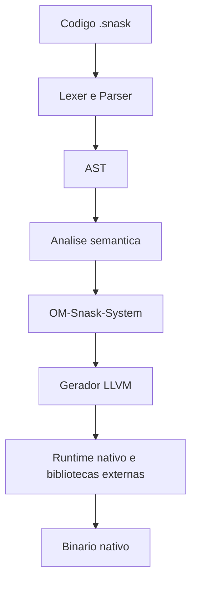

# Arquitetura do Compilador e Runtime v0.4.1-alpha

Snask e compilado AOT. O compilador le `.snask`, constroi AST, roda analise semantica, integra contratos do OM-Snask-System, gera LLVM IR e chama o linker para produzir um binario nativo.

## Pipeline



## Snask nao e transpilador

O compilador nao gera C como saida principal. Chamadas para bibliotecas C entram como simbolos externos/ABI no LLVM. O codigo do usuario continua Snask.

## OM-Snask-System

O OM-Snask-System e a camada unica para:

- zonas e arenas;
- stack/heap/promotion;
- recursos nativos com cleanup deterministico;
- deducao de contratos a partir de headers C;
- patches pequenos `.om.snif` quando a heuristica falha;
- bloqueio conservador de APIs inseguras.

Exemplo compilavel de zona comum:

```snask
class main {
    fun start() {
        zone "app" {
            print("zona ativa\n")
        }
    }
}
```

Exemplo conceitual de interop via OM:

```text
import_c_om "SDL2/SDL.h" as sdl2

class main {
    fun start() {
        zone "window" {
            let window = sdl2.create_window("App", 0, 0, 800, 600, sdl2.WINDOW_HIDDEN)
        }
    }
}
```

## Runtime

O runtime fornece as funcoes nativas que o LLVM chama para IO, strings, SNIF, GUI experimental, SQLite, OM e memoria crua do perfil `systems`.

## Perfis

- `humane`: padrao, runtime completo e diagnosticos humanos.
- `systems`: baixo nivel com runtime disponivel.
- `baremetal`: direcao freestanding; algumas partes de std/runtime devem ser bloqueadas.

Flags de tamanho como `--tiny`, `--release-size`, `--min-runtime` e `--extreme` selecionam fatias menores do runtime/linker.

## Fonte de verdade

- Status de features: `docs/reference/FEATURE_STATUS.md`.
- Memoria e interop: `docs/systems/OM_SNASK_SYSTEM.md`.
- Diagnosticos: `docs/reference/HUMANE_DIAGNOSTICS.md`.
